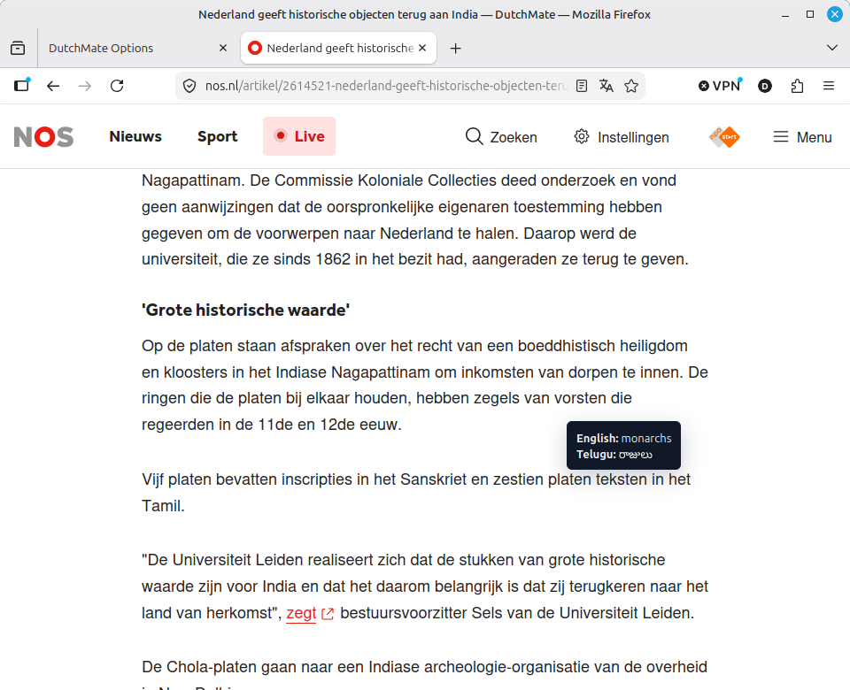

<p align="center">
  
</p>

# DutchMate

Learn Dutch while reading the web, with English and Telugu translations close by.

DutchMate is a Manifest V3 browser extension for Dutch learners who move between Dutch, English, and Telugu. Hover a word or select a short phrase on any normal webpage, and DutchMate shows a lightweight translation tooltip in context.



## What DutchMate Does

DutchMate helps learners keep reading instead of constantly switching tabs to translate words. It is currently focused on the Dutch-English-Telugu learning triangle:

- `nl`: Dutch
- `en`: English
- `te`: Telugu

The first audience is Telugu-speaking people in the Netherlands who already use English and want Dutch to become easier to understand in everyday web reading.

## How It Works

```text
Open a webpage -> hover a word or select text -> read the tooltip translation
```

Behind the scenes:

```text
webpage hover/selection
-> content script
-> background worker
-> DutchMate backend or local JSON endpoint
-> tooltip
```

Fresh installs use the hosted DutchMate backend by default:

```text
https://dutchmate-backend.onrender.com/translate
```

Store-ready builds hide custom provider controls from normal users. Local-testing builds can point the extension at a local or custom JSON translation endpoint.

## Features

- Hover translation for individual words.
- Selection translation for short words, phrases, and sentences.
- Optional hover mode for word-only or compact sentence context translation.
- Dual-language output that can translate into the other two supported languages.
- Source language setting with Auto, Dutch, English, and Telugu.
- Target language setting for Dutch, English, and Telugu.
- Extension-wide enable/disable controls.
- Hover delay and max selection length controls.
- Local persistent cache for successful selected single-word lookups.
- Clear-cache control in the Options page.
- Separate Chrome and Firefox builds from the same TypeScript source.
- Small backend with provider adapters for local-dev, Google Cloud Translation, Azure Translator, DeepL, and MyMemory.

## Screenshots

More screenshots live in [frontend/assets/screenshots](frontend/assets/screenshots):

- Hover translation: [dutchmate-firefox-01-hover.png](frontend/assets/screenshots/dutchmate-firefox-01-hover.png)
- Selection translations: [Dutch](frontend/assets/screenshots/dutchmate-firefox-02-selection-Dutch.png), [English](frontend/assets/screenshots/dutchmate-firefox-02-selection-English.png), [Telugu](frontend/assets/screenshots/dutchmate-firefox-02-selection-Telugu.png)
- Language settings: [dutchmate-firefox-03-languages.png](frontend/assets/screenshots/dutchmate-firefox-03-languages.png)
- Privacy settings: [dutchmate-firefox-04-privacy.png](frontend/assets/screenshots/dutchmate-firefox-04-privacy.png)

## Getting Started

Prerequisites:

- Node.js compatible with the project toolchain.
- Corepack enabled.
- pnpm `9.15.9` through the package manager declaration.

Install dependencies:

```bash
corepack pnpm install
```

Run the full local verification suite:

```bash
corepack pnpm verify
```

`verify` runs tests, TypeScript checks, and both extension builds.

## Build The Extension

Build both browser targets:

```bash
corepack pnpm build
```

Build one target:

```bash
corepack pnpm build:chrome
corepack pnpm build:firefox
```

Build outputs:

- Chrome: `dist/chrome`
- Firefox: `dist/firefox`

Package store-ready builds:

```bash
corepack pnpm package:extensions
```

## Load In A Browser

Chrome:

1. Run `corepack pnpm build:chrome`.
2. Open `chrome://extensions`.
3. Enable Developer mode.
4. Choose "Load unpacked".
5. Select `dist/chrome`.

Firefox:

1. Run `corepack pnpm build:firefox`.
2. Open `about:debugging#/runtime/this-firefox`.
3. Choose "Load Temporary Add-on...".
4. Select `dist/firefox/manifest.json`.

See [docs/release/manual-testing.md](docs/release/manual-testing.md) for the browser regression checklist.

## Development

Common commands:

```bash
corepack pnpm test
corepack pnpm typecheck
corepack pnpm verify
corepack pnpm dev:chrome
corepack pnpm dev:firefox
corepack pnpm frontend:dev
corepack pnpm mock:translate
```

Run a local backend:

```bash
corepack pnpm backend:dev
```

Run it with a local `.env` file:

```bash
cp .env.example .env
corepack pnpm backend:dev:env
```

Smoke-test the backend:

```bash
corepack pnpm backend:smoke
```

Build a local-testing extension when you want the Options page to expose custom endpoint controls:

```bash
corepack pnpm build:chrome:local-testing
corepack pnpm build:firefox:local-testing
```

Then set the provider endpoint in Options to:

```text
http://localhost:8787/translate
```

## Configuration

The browser extension stores user settings in browser storage. Defaults include:

- extension enabled;
- hover translation enabled;
- selected-text translation enabled;
- word hover mode;
- `450 ms` hover delay;
- `150` character selection limit;
- source language `auto`;
- target language `en`;
- dual-language output enabled;
- hosted DutchMate backend endpoint.

The backend reads environment variables from `.env` when run with `backend:dev:env`. See [.env.example](.env.example) and [docs/architecture/local-backend.md](docs/architecture/local-backend.md) for provider-specific settings.

Supported backend providers:

- `local-dev`
- `google-translate`
- `azure-translator`
- `deepl`
- `mymemory`

## Project Structure

```text
src/content/       Webpage interaction, hover/selection behavior, tooltip UI
src/background/    Extension runtime message handling and storage adapters
src/options/       Options page UI and settings controls
src/shared/        Shared settings, language, and endpoint utilities
src/translation/   Extension-side translation provider and cache logic
backend/           Local/hosted translation backend and provider adapters
scripts/           Build, packaging, manifest, asset, and smoke-test helpers
frontend/          Public site and store/marketing assets
assets/            Store package assets
docs/              Product, architecture, operations, release, and process docs
```

Start with [docs/README.md](docs/README.md) when looking for deeper product, architecture, release, or operations notes.

## Architecture

DutchMate keeps browser behavior, settings, provider calls, and backend provider selection separated:

- Content scripts own page interaction and tooltip placement.
- The background worker owns extension runtime messages and provider calls.
- The Options page owns user-facing settings.
- Translation providers sit behind a shared provider shape.
- Browser-specific manifest differences are generated at build time.

Read [docs/architecture/architecture.md](docs/architecture/architecture.md) for the full request contract, caching notes, and browser build strategy.

## Privacy

DutchMate sends only the text needed for a translation request: hovered text or selected text, source/target language settings, and translation context such as `hover` or `selection`.

The hosted backend is designed not to log raw translated text or translated results. Settings are stored in the browser. Successful selected single-word lookups may be cached locally on the user's device; hovered words, selected phrases, selected sentences, and failed translations are not persistently cached.

Read the full policy in [docs/release/privacy-policy.md](docs/release/privacy-policy.md).

## Built With

- TypeScript
- Vite
- Vitest
- Manifest V3
- webextension-polyfill
- Node.js backend using built-in HTTP APIs

## Contributing

Contributions are welcome. Good first areas include tooltip behavior, browser compatibility, accessibility, local backend provider tests, documentation, and release polish.

Before opening a pull request:

1. Keep changes focused.
2. Add or update tests when behavior changes.
3. Run `corepack pnpm verify`.
4. Update docs when setup, privacy, architecture, or release behavior changes.

The repo includes release and manual testing notes in [docs/release](docs/release).

## Roadmap

The current roadmap is tracked in the docs rather than this README:

- [Cache strategy](docs/architecture/cache-strategy.md)
- [Production backend plan](docs/architecture/production-backend-plan.md)

## License

This package declares the MIT license in [package.json](package.json). A standalone `LICENSE` file should be added before a public open-source launch.
